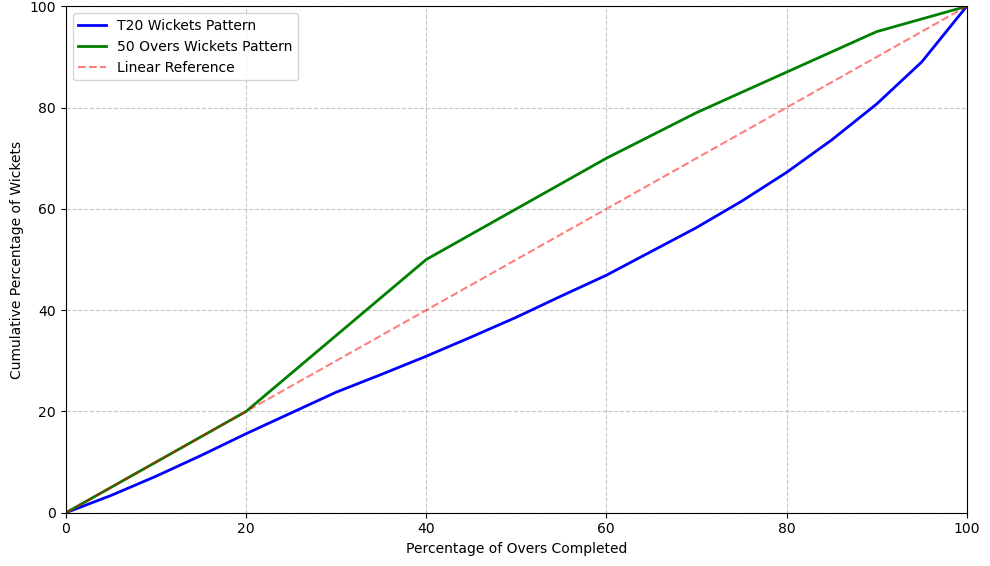
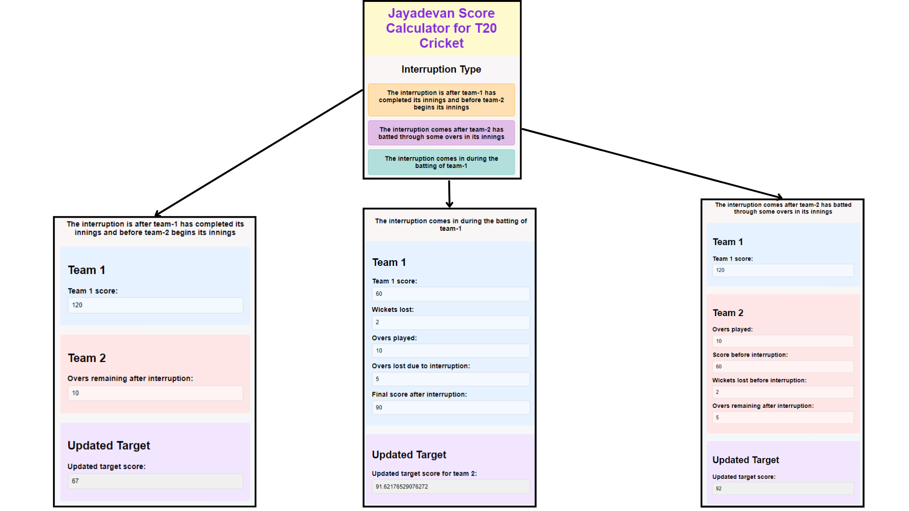

# Jayadevan method
- Project title - Jayadevan method
- Team name - Cricket curve crusaders
- Team number - 9
- Team members:
   1. Arnab
   2. Avinash Barak (23691)
   3. Krishanu Kumar Saha (23913) 
   4. Aditya Vijay Panwar (23027)
   5. Ayush Jha (23657)
   6. Aditi Pandey

## Introduction
Cricket is one of the most popular sports in the world. The International Cricket Council (ICC) has 108 member nations, including 12 full members and 96 associate members. The global popularity of cricket is reflected in its infrastructure, with approximately 500 international cricket stadiums worldwide. However, only about 15-20 of these stadiums are equipped with retractable roofs or comprehensive rain protection systems.

With matches lasting for several hours and no rain protection, the probability of rain interruption is significant. When rain interrupts a cricket match, it becomes crucial to have a fair method to reset target scores.

Moreover, the updated score reset after the rain interruption should be as close to the actual score that would otherwise be achieved by the team batting if there was no interruption. The most popular method to reset the target score was proposed by statisticians Frank Duckworth and Tony Lewis in 1996-97, first applied in a Zimbabwe vs England ODI match, and was officially adopted by the ICC in 1999.

However it was shown by V. Jayadevan in 2002 that Duckworth Lewis method is not optimal and proposed an alternative method. His proposed method is based on patterns observed in historical data of matches without any priors. VJD method proposed by him is being used by BCCI since 2007 in domestic cricket.

In recent years, Twenty20 (T20) cricket has seen an explosive rise in popularity compared to traditional 50-over One Day Internationals (ODIs), with leagues like IPL and BBL drawing massive global audiences. The shorter format has fundamentally different scoring patterns, with teams maintaining higher run rates throughout and employing more aggressive strategies from the start. Given this shift in cricket's landscape, it has become crucial to develop a specialized version of the Jayadevan method that accurately accounts for T20-specific batting approaches and resource utilization patterns.

## Methods
### Data gathering
For our analysis, we required a comprehensive dataset of T20 international matches that includes ball-by-ball data, specifically focusing on scoring patterns and resource utilization across different phases of the game.

After searching the internet and comparing the datasets available, we decided to use the Ball-by-Ball International T20 dataset from Kaggle(link - https://www.kaggle.com/datasets/jamiewelsh2/ball-by-ball-it20?resource=download).

The dataset covers 425,118 T20 international matches from 2005-2021, providing comprehensive ball-by-ball data that includes detailed scoring progression, resource utilization metrics, match context information, and a large sample size spanning multiple years and conditions - allowing us to effectively analyze modern T20 cricket patterns.
   
### Data cleaning
The initial dataset contained many columns that were not relevant for our analysis, so we selected only the essential columns needed (Match ID, Over, Ball, Innings Runs, and Innings Wickets) and filtered the dataset to retain only these columns while resetting the index.

This streamlined our analysis by reducing the dataset size while preserving all critical information needed for analyzing scoring patterns and resource utilization in the Jayadevan method.

### Finding the normal distribution of runs
To analyze the normal distribution of runs in T20 matches, we first calculated the average runs scored in each over of the first innings across all matches. Once we had the over numbers and their corresponding average runs, we converted these into cumulative percentages - representing the percentage of overs completed and the percentage of total runs scored up to that point.

We plotted the cumulative percentage of overs completed against the cumulative percentage of total runs scored and compared it to the Jayadevan's original 50-over curve.

    

The graph shows key differences between T20 and 50-over cricket scoring patterns:

1. Early Acceleration: The T20 curve (blue) shows a steeper initial rise compared to the 50-over Jayadevan curve (green) when compared to the later stages, indicating that teams in T20s start scoring more aggressively from the very beginning. This reflects the fundamental difference in batting approach where T20 teams cannot afford a conservative start.

2. Middle Overs Dynamics: Between 20-60% of overs (roughly overs 4-12 in T20s), the T20 curve closely follows but stays slightly above the 50-over curve. This suggests that while the scoring rate moderates after the powerplay, it remains higher than equivalent phases in 50-over cricket.

3. Death Overs Contrast: In the final phase (last 30% of overs), the T20 curve shows a relatively gentler slope compared to ODIs. This is counterintuitive but can be explained by:
   - Teams in T20s maintain a high scoring rate throughout, leaving less room for dramatic acceleration at the death
   - ODI teams, having preserved wickets through a more conservative start, can accelerate more dramatically in the final overs

These differences demonstrate why T20s need a specialized version of the Jayadevan method.

### Getting polynomial fit for normal distribution of runs
To find the best polynomial fit for the normal distribution of runs, we tested polynomial equations of degrees 1 through 4 (linear, quadratic, cubic, and quartic). The equations obtained were:

| Model     | MSE    | Equation |
|-----------|--------|----------|
| Linear    | 1.1945 | R = 0.988876692O - 1.670526316 |
| Quadratic | 0.4266 | R = 0.001183071O² + 0.864654204O + 0.606885965 |
| Cubic     | 0.0386 | R = 0.000033551O³ - 0.004101282O² + 1.092049170O - 1.621349845 |
| Quartic   | 0.0376 | R = -0.000000069O⁴ + 0.000048060O³ - 0.005097418O² + 1.116662632O - 1.778668731 |

Where:
- R represents the cumulative percentage of runs scored
- O represents the cumulative percentage of overs completed

Based on the error metrics, the cubic polynomial provides the best balance of accuracy and simplicity, with an MSE of 0.0386 compared to the quartic's marginally better 0.0376. We therefore selected the cubic equation for our modified T20 Jayadevan method.

### Finding the normal distribution of target score
To create a target adjustment curve, we sorted overs by their average run-scoring potential in descending order and calculated cumulative percentages for both overs and target scores. This approach weights each over based on its typical scoring rate rather than just chronological position, providing a more accurate basis for target adjustments.

We plotted the cumulative percentage of overs completed against the cumulative percentage of total runs scored and compared it to the Jayadevan's original 50-over curve, which was developed for One Day International (ODI) matches.

    

The graph shows two key differences between T20 and ODI target score distributions:

1. Middle Overs: The ODI curve shows higher resource values in middle overs compared to T20s, reflecting ODI's greater emphasis on strategic accumulation and wicket preservation.

2. Overall Distribution: T20's curve is closer to equal distribution, indicating more uniform scoring opportunities across overs compared to ODI's distinct phases.

These differences further highlight why T20 cricket needs a modified target adjustment approach.

### Getting polynomial fit for normal distribution of target score
To find the best polynomial fit for the target distribution of runs, we tested polynomial equations of degrees 1 through 4 (linear, quadratic, cubic, and quartic). The equations obtained were:

| Model     | MSE    | Equation |
|-----------|--------|----------|
| Linear    | 1.2361 | R = 0.9873O + 3.5974 |
| Quadratic | 0.0207 | R = -0.0015O² + 1.1436O + 0.7323 |
| Cubic     | 0.0206 | R = 0.0000O³ - 0.0016O² + 1.1479O + 0.6908 |
| Quartic   | 0.0027 | R = -0.0000O⁴ + 0.0001O³ - 0.0058O² + 1.2518O + 0.0267 |

Based on the error metrics, the cubic polynomial provides the best balance of accuracy and simplicity, with an MSE of 0.0206 compared to the quartic's marginally better 0.0027. We therefore selected the cubic equation for our modified T20 Jayadevan method.

### Normal fall of wickets
To understand the typical pattern of wicket-taking in T20 matches, we analyzed the average wickets fallen per over across all matches in our dataset and compared it to the 50-over fall of wickets.

    

The graph shows key differences in wicket-falling patterns between T20 and 50-over cricket:

- T20 matches have a more gradual wicket-falling curve compared to 50-over matches because now the teams have same 10 wickets to play with but less number of overs to play
- The lower rate of wickets falling in T20s (~5% lower at any stage) allows teams to play more aggressively

This pattern of fewer wickets falling in T20 cricket enables the aggressive batting style that characterizes the format.

### Preparation of target table
We then prepared the final target table for the Jayadevan method for T20 matches using the above information as:
- The first column of the table shows the cumulative percentage of overs completed
- The second column corresponds to the cumulative percentage of target score that we got by fitting the polynomial equation of degree 3 to the normal distribution of target score
- Remaining columns correspond to the cumulative percentage of normal score for the cumulative percentage of wickets fallen. We got these values from the curve corresponding to normal score and corresponding normal fall of wickets. The intermediate values were calculated using linear interpolation.

The final target table for T20 matches is attached in the appendix.

## Results 

### Asking V. Jayadevan for feedback
We forwarded the final target table to V. Jayadevan for his feedback

    

V. Jayadevan reply was as follows:

    

### Development of web app

After testing the method on few cases by hand and getting the correct results, we coded the method in JavaScript and integrated it with HTML and CSS to create a web app.

We have hosted the web app using GitHub pages which is a free service provided by GitHub for hosting static web apps and can be accessed by anyone in the world.

The user journey of the web app is as follows:

    

The link to the web app is: https://victor-explore.github.io/jayadevan-score-calculator-T20/

### Comparison with Duckworth Lewis method
These are the few cases where the present Duckworth Lewis method fails and the Jayadevan method T20 method developed by the team performs better:

#### Case 1:
- In the 2009 ICC World T20 match between South Africa and England at SuperSport Park in Centurion on 27 September 2009:
  - South Africa had scored 85/3 in 9 overs with AB de Villiers (30* off 18) and Albie Morkel at crease when rain interrupted.
  - The match was reduced to a 9-over chase.
  - The DL method set a target of 121 runs in 9 overs (13.44 RRR) which is unrealistic as South Africa was scoring at 9.44 runs per over.
- If the calculator developed by our team would have been used then the target would have been 94 runs in 9 overs (10.44 RRR), which is more realistic.

#### Case 2:
- In 2021 Indian Premier League (IPL) match between the Delhi Capitals (DC) and the Punjab Kings (PBKS) on April 18, 2021 at Wankhede Stadium, Mumbai:
  - Delhi Capitals scored 195 runs for 4 wickets in 20 overs
  - The match faced a rain interruption shortly after PBKS began their innings. At that point, PBKS had scored 26 runs for no loss in 3 overs
  - Following the rain delay, the DLS method was applied to revise PBKS's target. The new target was set at 124 runs in 15 overs, down from the original target of 196 runs in 20 overs.
  - In simple words 194 runs in 20 overs corresponds to run rate of 9.8. Whereas the reset target of 124 runs in 15 overs corresponds to run rate of 8.2. The target run rate given to PBKS was lower as compared to original target run rate and the wickets remaining were more.
- If the calculator developed by our team would have been used then the target would have been 152 runs in 15 overs, which seems more realistic.

## Conclusion
The team chose to work on this topic because the current Duckworth Lewis method is not optimal but continues to be used because of lack of better alternative. 

Taking inspiration from the fact that Jayadevan method proposed by V. Jayadevan in 2002 is more suitable than Duckworth Lewis method for 50 overs, the team followed the same approach as original Jayadevan method and developed a method for T20 cricket.

We searched on the internet for the instances where the Duckworth Lewis method was being criticized and used our method to calculate the target score in those cases. From the calculations we found that our method was better than Duckworth Lewis method that is presently being used to reset the target score.

Further a user friendly web app was developed and hosted online so that the method can be easily accessible to everyone anywhere in the world free of cost.
